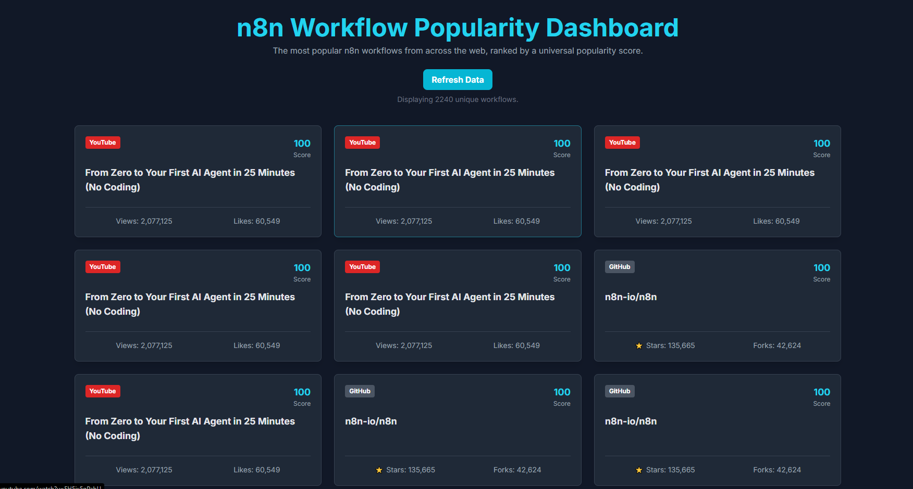

# n8n Workflow Popularity System

A fully automated system that identifies, ranks, and serves the most popular n8n workflows from GitHub, YouTube, and the n8n Community Forum via a REST API and interactive frontend dashboard.

## Frontend Preview

Here’s how the dashboard looks in action:



##  Key Features
1. **Multi-Platform Collection**: Gathers data from three distinct sources: YouTube, GitHub, and the n8n Community Forum.

2. **Cross-Platform De-duplication**: Ensures that every workflow in the final dataset is unique by using the source link as an identifier, even if it's popular on multiple platforms.

3. **Weighted Popularity Score**: Ranks all workflows using a robust scoring system that considers views, stars, and engagement ratios for fair cross-platform comparison.

4. **Country-Specific Search**: Performs targeted searches on YouTube for both the US and India to fulfill country segmentation requirements.

5. **Automated Data Pipeline**: The main.py script is a cron-ready job that automates the entire data collection, cleaning, and scoring process.

6. **REST API with Frontend**: Serves the final ranked data via a FastAPI endpoint and includes an interactive index.html dashboard to view and refresh the data on demand.

## Installation and Set-Up

#### Clone the repository 

```git clone https://github.com/PriyanshuPilaniwala032/Speak-Genie.git```
```cd ./Speak-Genie/workflows```


#### Install the requiremens using the following command:

```pip install -r requirements.txt```

#### Confirgure API keys

Make ```.env``` and configure your API keys
```YOUTUBE_API_KEY="your_api_key_here"``` 
```GITHUB_TOKEN="your_api_key_here"``` 

## Running the System

Run the main pipeline by 

```python main.py```

After this start the API server

```uvicorn api:app --reload```

To view the frontend open the ```index.html``` file in your web browser to see the web app in action. The dashboard will automatically connect to your running API.

## API Endpoints

```GET /```: Retrieves the complete, ranked list of popular workflows. This is the primary data endpoint.

```POST /refresh```: Triggers the main.py data collection script to run as a background process, allowing for on-demand data updates.
